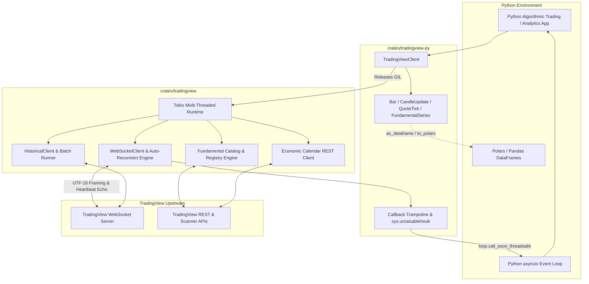
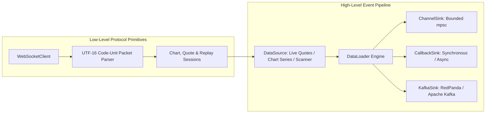

# TradingView Data Provider (`tradingview-rs` & `tradingview-py`)


[](https://crates.io/crates/tradingview-rs)
[](https://pypi.org/project/tradingview-rs/)
[](https://docs.rs/tradingview-rs)
[](LICENSE)

A high-performance, asynchronous TradingView data provider written in Rust (`tradingview-rs`) with first-class Python bindings (`tradingview-py` via PyO3 0.29). Inspired by [TradingView-API](https://github.com/Mathieu2301/TradingView-API), this project delivers institutional-grade market data streaming, historical OHLCV series, corporate fundamental metrics, and global economic calendar events with direct [Polars](https://pola.rs) DataFrame support.

---

## Architecture Overview



### Rust Core Architecture (Two-Tier Model)



---

## Features

- [x] **Zero GIL Contention**: Long-running network I/O, batch downloads, and deserialization execute in Tokio background threads with the Python GIL released.
- [x] **Direct Polars Support**: Fetch historical candlestick bars, batch series, fundamental indicators, and economic calendar events directly as high-performance Polars DataFrames (`as_dataframe=True`).
- [x] **Dual-Mode Streaming**: Consume live quotes and in-flight candlesticks through native asynchronous iterators (`async for`) or synchronous callbacks (`add_callback`) dispatched on the asyncio event loop with exception isolation (`sys.unraisablehook`).
- [x] **Strict Wire Parity**: Accurate UTF-16 code-unit framing (`~m~<len>~m~<payload>`), 1:1 heartbeat echoing, and protocol parity matching TradingView web clients.
- [x] **Event-Driven Rust Pipeline**: High-level `DataLoader` architecture connecting custom sources to Channel, Callback, and Kafka sinks with backpressure and graceful cancellation.
- [x] **Historical Market Data**: Single-symbol and concurrent multi-symbol batch fetching with configurable concurrency limits and per-symbol timeouts.
- [x] **Corporate Fundamentals**: Date-versioned fundamental Pine study catalog (`tradingview::fundamental`) querying annual, quarterly, and TTM balance sheet, income, and cash flow metrics.
- [x] **Economic Calendar**: Global macroeconomic event queries filtered by ISO 3166-1 country codes, timestamps, and importance levels.
- [x] **Credential & Token Authentication**: Support for session auth tokens, full credential login with optional TOTP 2FA, and cookie-authenticated TradingView session token retrieval (`get_tradingview_token`).

---

## Installation

### Python (`tradingview`)

Install from PyPI:

```bash
pip install tradingview-rs
```

To enable direct Polars and Pandas DataFrame conversion:

```bash
pip install "tradingview-rs[polars,pandas]"
```

To build and install locally from source (requires CMake, Clang or GCC, and Perl to build native `wreq` / BoringSSL dependencies):

```bash
cd crates/tradingview-py
pip install maturin
maturin develop --release
```

### Rust (`tradingview-rs`)

Add to your `Cargo.toml`:

```toml
[dependencies]
tradingview-rs = "0.4"
```

#### Feature Flags

| Feature | Default | Description |
| :--- | :---: | :--- |
| `rustls-tls` | ✅ | Pure-Rust TLS backed by `rustls` (WebSocket transport only) |
| `native-tls` | — | Platform-native TLS via OpenSSL / SChannel / Security Framework (WebSocket transport only) |
| `user` | ✅ | User authentication support (login, TOTP 2FA, session cookies via `wreq`) |

*Note*: All HTTP endpoints use `wreq` with BoringSSL. The `rustls-tls` and `native-tls` flags configure WebSocket transport only.
---

## Python Quick Start

### 1. Historical Candlesticks Directly to Polars

```python
import asyncio
from tradingview import TradingViewClient, Interval

async def main():
    client = TradingViewClient()

    # Fetch 100 daily bars directly as a Polars DataFrame
    df = await client.get_historical("AAPL", "NASDAQ", Interval.OneDay, n_bars=100, as_dataframe=True)
    print(df)
    # Output columns: timestamp, open, high, low, close, volume

    # Or retrieve structured HistoricalSeries with .to_polars() and .to_pandas()
    series = await client.get_historical("BTCUSDT", "BINANCE", Interval.OneHour, n_bars=50)
    print(f"{series.symbol} on {series.exchange}: {len(series)} bars")
    latest = series[-1]
    print(f"Latest Close: {latest.close} (Volume: {latest.volume})")

    # Concurrent batch retrieval as a dictionary of DataFrames
    batch_df = await client.get_historical_batch(
        [("AAPL", "NASDAQ"), ("MSFT", "NASDAQ")],
        interval=Interval.OneDay,
        n_bars=30,
        as_dataframe=True,
    )
    print("AAPL rows:", batch_df["NASDAQ:AAPL"].height)
    print("MSFT rows:", batch_df["NASDAQ:MSFT"].height)

    await client.close()

asyncio.run(main())
```

### 2. Real-Time Quotes & Candlestick Streaming

```python
import asyncio
from tradingview import TradingViewClient, Interval, QuoteTick, CandleUpdate

def on_quote(tick: QuoteTick):
    print(f"[Callback] {tick.symbol} Price={tick.price} Bid={tick.bid} Ask={tick.ask}")

def on_candle(candle: CandleUpdate):
    print(f"[Callback] {candle.symbol} Close={candle.close} High={candle.high} Low={candle.low}")

async def main():
    client = TradingViewClient()

    # 1. Quote streaming with callback & async iterator
    quote_sub = await client.subscribe_quotes(["BINANCE:BTCUSDT"], callback=on_quote)

    count = 0
    async for tick in quote_sub:
        print(f"[Iterator] Tick: {tick.symbol} @ {tick.price}")
        count += 1
        if count >= 3:
            break
    await quote_sub.stop()

    # 2. Live in-flight 1-minute candle streaming
    candle_sub = await client.subscribe_bars(["BINANCE:ETHUSDT"], interval=Interval.OneMinute, callback=on_candle)

    count = 0
    async for candle in candle_sub:
        print(f"[Iterator] Live Candle: {candle.symbol} Close={candle.close} Vol={candle.volume}")
        count += 1
        if count >= 2:
            break
    await candle_sub.stop()

    await client.close()

asyncio.run(main())
```

### 3. Fundamentals & Global Economic Calendar

```python
import asyncio
from tradingview import TradingViewClient, FinancialPeriod, EconomicImportance

async def main():
    client = TradingViewClient()

    # Query corporate revenue history directly as a Polars DataFrame
    fund_df = await client.get_fundamental(
        "AAPL", "NASDAQ", "total_revenue", FinancialPeriod.FiscalYear, n_bars=5, as_dataframe=True
    )
    print("Revenue History:")
    print(fund_df)

    # Query high-importance macroeconomic events for the US
    events_df = await client.get_economic_calendar(
        countries=["US"], min_importance=EconomicImportance.High, as_dataframe=True
    )
    print("Upcoming US Macroeconomic Releases:")
    print(events_df.select(["date", "country", "title", "indicator", "actual", "forecast"]))

    await client.close()

asyncio.run(main())
```

### 4. ProData Server Endpoint & Entitlements

```python
import asyncio
import os
from dotenv import load_dotenv
from tradingview import TradingViewClient, DataServer, Interval

async def main():
    username = os.getenv("TV_USERNAME")
    password = os.getenv("TV_PASSWORD")
    if username and password:
        # 1. Login with credentials to establish authenticated session cookies
        login_client = await TradingViewClient.login(username=username, password=password)
        # 2. Retrieve TradingView session token using session cookies
        token = await login_client.get_tradingview_token()
        await login_client.close()
    else:
        # Fall back to pre-configured auth token if available
        token = os.getenv("TV_AUTH_TOKEN")

    # 3. Instantiate client with token and ProData endpoint
    client = TradingViewClient(auth_token=token, server=DataServer.ProData)

    df = await client.get_historical("AAPL", "NASDAQ", Interval.OneDay, n_bars=100, as_dataframe=True)
    print(f"Retrieved {df.height} bars from ProData")
    await client.close()

asyncio.run(main())
```

---

## Rust Quick Start

### 1. Historical Data Retrieval (Single & Batch)

```rust
use tradingview::historical::{BatchConfig, HistoricalClient, HistoricalRequest};
use tradingview::live::models::DataServer;
use tradingview::models::Interval;

#[tokio::main]
async fn main() -> Result<(), Box<dyn std::error::Error>> {
    let client = HistoricalClient::new("unauthorized_user_token", DataServer::Data);

    // 1. Single symbol historical fetch
    let request = HistoricalRequest::builder()
        .symbol("AAPL")
        .exchange("NASDAQ")
        .interval(Interval::OneDay)
        .num_bars(100)
        .build();

    let result = client.retrieve(request).await?;
    println!("Retrieved {} bars for {}", result.len(), result.symbol_info.name);
    if let Some(first) = result.data.first() {
        println!("Earliest timestamp: {}", first.timestamp);
    }

    // 2. Concurrent multi-symbol batch retrieval
    let symbols = vec![
        ("AAPL".to_string(), "NASDAQ".to_string()),
        ("MSFT".to_string(), "NASDAQ".to_string()),
    ];

    let batch = client
        .retrieve_batch(
            &symbols,
            Interval::OneDay,
            Some(50),
            BatchConfig {
                max_concurrency: 4,
                ..Default::default()
            },
        )
        .await;

    println!("Batch finished: {} succeeded, {} failed", batch.successful.len(), batch.failed.len());

    Ok(())
}
```

### 2. Real-Time WebSocket Quote Streaming

```rust
use serde_json::Value;
use std::sync::Arc;
use tokio::signal;
use tradingview::live::{handler::Handler, models::TradingViewDataEvent, websocket::WebSocketClient};
use tradingview::{DataServer, Error};

struct QuoteLogger;

impl Handler for QuoteLogger {
    fn handle_events(&self, event: TradingViewDataEvent, message: &[Value]) {
        if event == TradingViewDataEvent::OnQuoteData {
            println!("Quote update: {:?}", message);
        }
    }
    fn handle_quote_data(&self, message: &[Value]) {
        println!("Legacy quote update: {:?}", message);
    }
    fn handle_series_data(&self, _event: TradingViewDataEvent, _messages: &[Value]) {}
    fn notify_error(&self, error: Error, message: &[Value]) {
        eprintln!("Socket error: {:?}, payload: {:?}", error, message);
    }
}

#[tokio::main]
async fn main() -> Result<(), Box<dyn std::error::Error>> {
    let ws = WebSocketClient::builder()
        .auth_token("unauthorized_user_token")
        .server(DataServer::Data)
        .handler(QuoteLogger)
        .build()
        .await?;

    Arc::clone(&ws).spawn_reader_task();

    let session = tradingview::utils::gen_session_id("qs");
    ws.create_quote_session(&session).await?;
    ws.set_fields(&session).await?;
    ws.add_symbols(&session, &["BINANCE:BTCUSDT", "NASDAQ:AAPL"]).await?;

    println!("Streaming live quotes. Press Ctrl+C to exit.");
    signal::ctrl_c().await?;

    ws.delete_quote_session(&session).await?;
    ws.close().await?;
    Ok(())
}
```

### 3. Event-Driven Pipeline (`DataLoader`)

```rust
use std::sync::Arc;
use tradingview::loader::DataLoader;
use tradingview::sink::callback::CallbackSink;
use tradingview::sink::channel::ChannelSink;
use tradingview::source::tradingview::WebSocketSource;

#[tokio::main]
async fn main() -> Result<(), Box<dyn std::error::Error>> {
    let (channel_sink, mut rx) = ChannelSink::new(1024);

    let callback_sink = CallbackSink::new(|event| {
        println!("Callback received event: {:?}", event);
        Ok(())
    });

    let source = WebSocketSource::builder()
        .auth_token("unauthorized_user_token")
        .symbols(vec!["BINANCE:BTCUSDT".to_string()])
        .build()?;

    let mut loader = DataLoader::builder()
        .source(Box::new(source))
        .add_sink(Arc::new(channel_sink))
        .add_sink(Arc::new(callback_sink))
        .build()?;

    let handle = loader.start().await?;

    tokio::spawn(async move {
        while let Some(event) = rx.recv().await {
            println!("Channel received: {:?}", event);
        }
    });

    tokio::time::sleep(std::time::Duration::from_secs(5)).await;
    handle.stop().await?;

    Ok(())
}
```

---

## Workspace Structure

```text
tradingview-rs/
├── Cargo.toml                       # Virtual workspace manifest
├── crates/
│   ├── tradingview/                 # Pure Rust core library (tradingview-rs)
│   │   ├── Cargo.toml
│   │   ├── src/                     # Protocol framing, WebSocket engine, loader, fundamental
│   │   ├── tests/                   # Wire and integration tests
│   │   ├── examples/                # Runnable Rust examples
│   │   └── benches/                 # Criterion microbenchmarks
│   └── tradingview-py/              # PyO3 0.29 CPython extension (tradingview)
│       ├── Cargo.toml               # Native extension build config (abi3, tokio-runtime)
│       ├── pyproject.toml           # Maturin package metadata and dependencies
│       ├── src/                     # PyO3 bindings, models, callback dispatcher, streaming
│       ├── python/tradingview/      # Python package exports, PEP 561 py.typed, .pyi stubs
│       └── tests/                   # Pytest async and typing validation suite
└── .github/
    └── workflows/
        ├── ci.yml                   # Rust formatting, clippy, tests + Python test and type matrix
        └── publish.yml              # crates.io Trusted Publishing + PyPI Twine release pipeline
```

---

## Development & Testing

Run all Rust and Python checks locally:

```bash
# Format & Lint Rust
cargo fmt --all -- --check
cargo clippy --all-targets --all-features -- -D warnings

# Execute Rust Workspace Tests (201 passing tests)
cargo test --workspace --no-default-features

# Build Python Extension & Run Python Test Suite (22 passing tests)
cd crates/tradingview-py
maturin develop --release
pytest -v

# Type Verification
mypy python/ tests/
ruff check python tests
```

---

## Publishing to PyPI

The release workflow `.github/workflows/publish.yml` is triggered automatically on tag creation (`v*`) or via manual dispatch:

- **crates.io**: Authenticates via OIDC Trusted Publishing and publishes `tradingview-rs`.
- **PyPI**: Builds source distribution and wheels with `maturin build --release`, then uploads via `twine` using your configured credentials (supporting `~/.pypirc` or `PYPI_API_TOKEN` secret).

---

## License

This project is licensed under the [MIT License](LICENSE).

*Disclaimer*: This library is not affiliated with, maintained, or endorsed by TradingView. Use in compliance with TradingView's Terms of Service.
